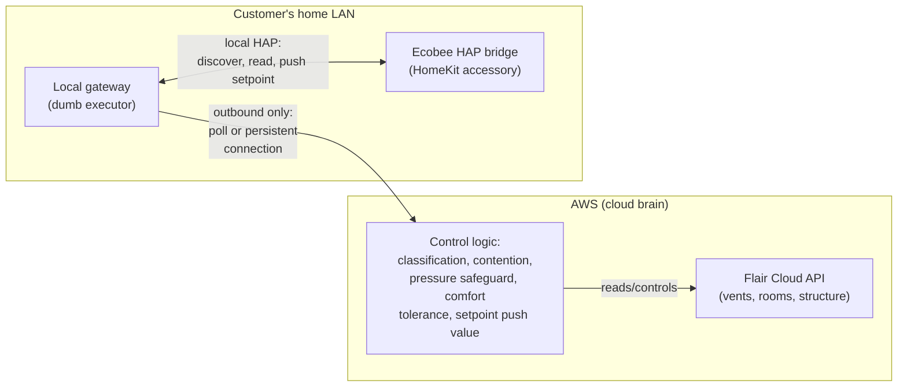

# Cloud Migration Plan

- [Cloud Migration Plan](#cloud-migration-plan)
  - [Status and origin of this document](#status-and-origin-of-this-document)
  - [Guiding principle: design for SaaS scale now](#guiding-principle-design-for-saas-scale-now)
  - [Compute and data layer on AWS](#compute-and-data-layer-on-aws)
    - [Worker and API services on Fargate](#worker-and-api-services-on-fargate)
    - [Redis and Postgres](#redis-and-postgres)
    - [Autoscaling signal](#autoscaling-signal)
    - [Graceful shutdown](#graceful-shutdown)
    - [Cost shape](#cost-shape)
  - [The observability gap: Loki and Grafana are NAS-hosted](#the-observability-gap-loki-and-grafana-are-nas-hosted)
  - [The local-network problem: HomeKit](#the-local-network-problem-homekit)
    - [How Apple solves this: the Home Hub relay pattern](#how-apple-solves-this-the-home-hub-relay-pattern)
    - [Why AWS can't reach into a home LAN](#why-aws-cant-reach-into-a-home-lan)
    - [Proposed architecture: cloud brain and local gateway](#proposed-architecture-cloud-brain-and-local-gateway)
    - [Relay-to-cloud connectivity](#relay-to-cloud-connectivity)
      - [Polling (recommended default)](#polling-recommended-default)
      - [MQTT (AWS IoT Core)](#mqtt-aws-iot-core)
      - [WebSocket](#websocket)
      - [Mesh VPN (Tailscale or WireGuard)](#mesh-vpn-tailscale-or-wireguard)
    - [Gateway form factor](#gateway-form-factor)
      - [Near-term (single household): reuse the NAS](#near-term-single-household-reuse-the-nas)
      - [Long-term (multi-tenant SaaS): dedicated physical gateway device](#long-term-multi-tenant-saas-dedicated-physical-gateway-device)
  - [Hard constraint: Flair must never drive setpoint or vent-balancing control](#hard-constraint-flair-must-never-drive-setpoint-or-vent-balancing-control)
  - [Open questions and not yet decided](#open-questions-and-not-yet-decided)

## Status and origin of this document

This is a living planning document, not a committed design — nothing here is scheduled or being built now. It exists to capture architectural thinking as it comes up, ahead of when a real move to the cloud is actually being planned.

This file was named and seeded by the SaaS Transformation planning pass's own "Cloud Deployment Feasibility on AWS Fargate" section, which concluded the worker/API architecture designed there runs on Fargate with no redesign, and explicitly deferred the concrete runbook to this file: *"Create this file, and start it from the observability-gap paragraph above, at the point you're ready to actually plan the move — not before."* The [Compute and data layer on AWS](#compute-and-data-layer-on-aws) and [observability gap](#the-observability-gap-loki-and-grafana-are-nas-hosted) sections below carry that mapping forward. Everything under [The local-network problem: HomeKit](#the-local-network-problem-homekit) is new — the original Fargate feasibility pass predates this app's HomeKit integration and doesn't address it; a real, confirmed incident (2026-09-12/13, the `flair-vents-automation-worker` container losing LAN presence after a router reboot) is what surfaced this as a genuine gap in the cloud story, not a hypothetical.

## Guiding principle: design for SaaS scale now

Every future design decision on this app should be evaluated against "does this still work as a multi-tenant, cloud-hosted product, not a single self-hosted household install?" — even while the only real deployment today is one household's own NAS. This doesn't mean over-building for scale that doesn't exist yet; it means not making a *local-only* assumption casually, since those are the assumptions that are hardest to unwind later. Concretely, when evaluating a new feature or integration, ask:

- Does it assume the process has direct LAN presence (multicast, broadcast, local-only discovery protocols)? If so, it needs an explicit answer for how it works when the decision-making process isn't on that LAN.
- Does it assume exactly one installation/household's worth of state, config, or credentials? (Already answered structurally for the core data model — see the SaaS Transformation plan's own multi-tenancy design — but worth re-asking for every new table/integration.)
- Does it require an integration to actively drive control that this app's own logic needs to own? See the hard constraint below — this is the one non-negotiable case already hit in practice.

## Compute and data layer on AWS

The worker/API architecture the SaaS Transformation plan designed (BullMQ job scheduler, per-installation Redis lock, stateless worker pool, `runTick()` untouched) was explicitly designed to be infra-agnostic — nothing in it depends on the NAS specifically. The concrete mapping, as already worked out:

### Worker and API services on Fargate

- **Worker containers** (`bun src/server/worker.ts`) → an ECS Fargate **Service** running N tasks from the same image already built for the NAS deploy. A Fargate task is a standard container with no host-level assumptions required — nothing about the worker (a long-running Node process holding a BullMQ `Worker`, connecting outbound to Redis/Postgres/Flair) needs EC2, host networking, or any NAS-specific mechanism. Task secrets come from AWS Secrets Manager/Parameter Store instead of the NAS's bind-mounted cert files — a config-source swap, not an architecture change.
- **API server** (`bun src/server/main.ts`) → a second Fargate Service, fronted by an Application Load Balancer with an ACM-issued certificate, replacing the current Caddy/DNS-01/LAN-only-hostname setup (see `docs/reverse-proxy-tls-setup.md`). Whether that ALB is internet-facing or VPC-internal is a real, separate decision from the worker-scaling question, not yet made.

### Redis and Postgres

- **Redis** → Amazon **ElastiCache for Redis**, reachable from Fargate tasks over VPC. BullMQ needs no Redis feature ElastiCache doesn't provide — the same `maxRetriesPerRequest: null`/`{prefix: "fva"}` configuration applies unchanged, just pointed at a different host.
- **Postgres** → Amazon **RDS for PostgreSQL** — `DB_HOST`/`DB_SSL`/`DB_SSL_CA_PATH` already externalize the connection target as env vars/secrets today, so this is a value change, not a code change.

### Autoscaling signal

**ECS Service Auto Scaling on a custom CloudWatch metric**, fed by the same `queue.getJobCounts().waiting` value already identified as the correct "add a worker" signal (queue lag, not CPU/memory — this workload is I/O-bound, not compute-bound). A small periodic Lambda, or the existing `Queue health snapshot` log event reformatted to also satisfy CloudWatch's Embedded Metric Format, publishes it; a target-tracking or step-scaling policy scales worker task count against it. Same signal, a different publishing destination — not a new metric to invent.

### Graceful shutdown

Fargate sends `SIGTERM` with a configurable `stopTimeout` before `SIGKILL` on scale-in/deploy — lines up directly with the worker's already-designed `SIGTERM` → `worker.close()` drain. `stopTimeout` just needs to be set at or above the tick watchdog timeout (90s), a tuning parameter, not a blocker.

### Cost shape

This workload — bursty, I/O-bound, needing only a small number of low-vCPU/low-memory tasks even at meaningful tenant counts — is exactly what Fargate is priced well for. Paying per-task-second for a small always-on Fargate Service is markedly cheaper here than provisioning and managing dedicated EC2 capacity sized for peak, especially before real tenant-count/load data exists to size anything more precisely.

## The observability gap: Loki and Grafana are NAS-hosted

The one piece that doesn't just "move" for free. Running compute on Fargate while keeping Loki/Grafana on the NAS means either a VPN/site-to-site tunnel (or Tailscale, already a pattern elsewhere in this homelab) back to the NAS for the Loki push, or migrating observability itself to a cloud-hosted equivalent — Grafana Cloud's free/paid tier, or a self-hosted Loki+Grafana pair on Fargate too (the same container images, same portability argument as the app itself). Not resolved — this is exactly the kind of decision that needs its own real evaluation once a move is actually being planned, not a default assumed here.

## The local-network problem: HomeKit

A real, confirmed incident (2026-09-12/13) surfaced this directly: the control loop's HomeKit/HAP integration to the household's Ecobee thermostat depends entirely on mDNS discovery and a direct local network connection to the accessory. Even *within the same house*, a container with no real LAN presence (Docker's default bridge network, versus the macvlan network the API server container correctly used) couldn't reach the device at all — see `src/server/util/homekit/discoveryRegistry.ts`'s own top-of-file comment and the networking fix in `deploy.yml` for the full incident writeup.

If this app's control loop ran on Fargate instead of on the household's own NAS, this isn't a networking misconfiguration to fix — it's structural. AWS has no path into a customer's home LAN at all, by design (that's a security boundary, not a gap). Flair's own vent/room/structure API is already fully cloud-native; HomeKit is the only piece of this app's current architecture with a hard local-presence requirement.

### How Apple solves this: the Home Hub relay pattern

HAP-over-IP has no remote/cloud variant — it's a local-only protocol (mDNS discovery, TLS over local LAN TCP). Apple's own "control your home devices from anywhere" experience isn't cloud-native HomeKit; it's cloud-*relayed* control of a **Home Hub** (an Apple TV, HomePod, or always-on iPad) that has real, permanent LAN presence. Your phone talks to Apple's relay servers over an authenticated tunnel; the hub does the actual local HAP conversation, because it's physically there. This is an architectural pattern (local relay + cloud-initiated tunnel), not a capability unique to Apple's own infrastructure.

### Why AWS can't reach into a home LAN

No inbound path exists from a cloud VPC into a residential LAN without something on the LAN side actively creating one (port-forwarding, fragile and something most users would never configure correctly; or an outbound-initiated tunnel/connection, the only realistic option for a real product).

### Proposed architecture: cloud brain and local gateway

The cloud owns everything that doesn't require local presence — which today is almost everything: ingesting Flair's zone/room/vent data, classification, contention resolution, the pressure safeguard, comfort-tolerance and sleep-mode logic, spike detection, occupancy debounce, alerting, and all persisted state. The local gateway owns only the narrow HomeKit-facing surface: discover the accessory, read its live state, and — when told a specific value by the cloud — push that setpoint. It should be a **dumb executor**, not a second copy of the decision logic, keeping the actual logic in exactly one place to reason about and update.

### Relay-to-cloud connectivity

The gateway must always be the one to **initiate** the connection outward — never the reverse. Residential routers don't reliably support inbound connections, and depending on that would be both fragile and a real security exposure.

#### Polling (recommended default)

The control loop already operates as a once-a-minute poll end-to-end (Flair itself is polled, not pushed to). A gateway that polls the cloud every 60 seconds ("here's my local reading — anything to push?") is a direct extension of that existing pattern, not a new paradigm — plain HTTPS request/response, no broker, no connection-state management, no reconnect/heartbeat logic to build, and no latency regression versus what this app already does today. The only place it stops being the obvious choice is at real multi-tenant scale, where constant polling from thousands of gateways becomes a nonzero cost — long-polling recovers most of push's efficiency without abandoning the simpler model.

#### MQTT (AWS IoT Core)

The standard AWS-native building block for "many small devices behind home NATs, each holding a persistent outbound connection to the cloud." Lower latency floor than polling (irrelevant here, since nothing in this app needs sub-minute reaction), at the cost of operating a persistent-connection protocol and its own certificate-based device identity/provisioning story.

#### WebSocket

A persistent connection to a purpose-built backend endpoint instead of AWS IoT Core specifically — similar tradeoffs to MQTT, without adopting another AWS service, at the cost of building and operating the connection-management layer yourself.

#### Mesh VPN (Tailscale or WireGuard)

Makes the gateway directly addressable from the cloud VPC as if it were on the same private network — architecturally the simplest option from the application code's own perspective (no protocol change at all). The cost is an added dependency on a third-party coordination service (or a self-hosted equivalent) and per-device enrollment to manage across a fleet.

### Gateway form factor

#### Near-term (single household): reuse the NAS

For today's single-installation reality, a dedicated physical device would be pure overhead. The existing NAS already has the one hard requirement validated (`tesla-macvlan` gives a container genuine LAN presence — see the 2026-09-12/13 incident for what happens without it). A gateway container on the same NAS, attached to the same macvlan network, is the practical choice for as long as this stays a single-household deployment.

#### Long-term (multi-tenant SaaS): dedicated physical gateway device

For a real multi-tenant product, requiring a customer to already own and correctly configure a NAS (or any always-on server) is not a viable onboarding story — most users aren't technical enough to self-host a relay container. The long-term answer is almost certainly a small, purpose-built, low-cost gateway device shipped to each customer as part of onboarding — the same physical-hub model Flair itself already uses for its own pucks/bridges, and the same shape as Apple's own Home Hub requirement, just as a dedicated appliance instead of repurposing a TV/speaker. Pre-provisioned with credentials/certs, plugs into power and the customer's LAN, connects outbound to the cloud on first boot with no local configuration required.

## Hard constraint: Flair must never drive setpoint or vent-balancing control

Flair's own API exposes a structure-level `set-point-mode` (SPC) — confirmed in `docs/flair-setpoint-propagation-research.md` — and when set to `"Flair App"`, Flair's own cloud service actively reasserts its own setpoint value over anything else that changes the thermostat, as part of its own home-evenness/room-balancing automation (Flair's own smart-vent product doing exactly what this app exists to do instead, with different logic). This app requires that mode to stay away from `"Flair App"` (referred to elsewhere as "manual mode") specifically so Flair's own automation never fights this app's own zone-level decisions.

This is a hard architectural constraint, not a per-household preference, and it must never be relaxed for any hypothetical deployment shape (including a future cloud-hosted one): **never propose falling back to Flair's own structure-setpoint push (`setpoint_delivery_mode: "flair"`) as a substitute for HomeKit delivery, or as a simpler default for a cloud-hosted architecture.** Flair's read-only data (vent positions, room data, structure info) remains fine to depend on centrally; only *Flair driving the actual comfort/setpoint decision* is off the table, for every customer, always.

## Open questions and not yet decided

- Polling vs. MQTT vs. WebSocket vs. mesh VPN for the gateway — polling is the current recommendation given today's latency requirements, but this hasn't been load-tested or costed at any real multi-tenant scale.
- What the actual gateway hardware would be (a repurposed Raspberry Pi class device vs. custom hardware), and the manufacturing/support/shipping burden that implies — completely unexplored.
- How gateway provisioning/pairing would work for a non-technical end user (QR code + companion app flow, similar to how Flair/Ecobee/most consumer smart-home hubs already onboard their own bridges).
- Whether every future local-presence-dependent integration (not just HomeKit) should route through the same gateway abstraction, or whether each needs its own case-by-case evaluation.
- Whether Loki/Grafana move to the cloud alongside compute, or stay NAS-hosted behind a tunnel — not decided.
- VPC topology, IAM policies, and an actual Terraform/CDK stack — none of this has been designed yet; this document captures feasibility and architectural mapping, not an executable runbook.
- No timeline or trigger condition has been set for when this actually becomes prioritized work.
