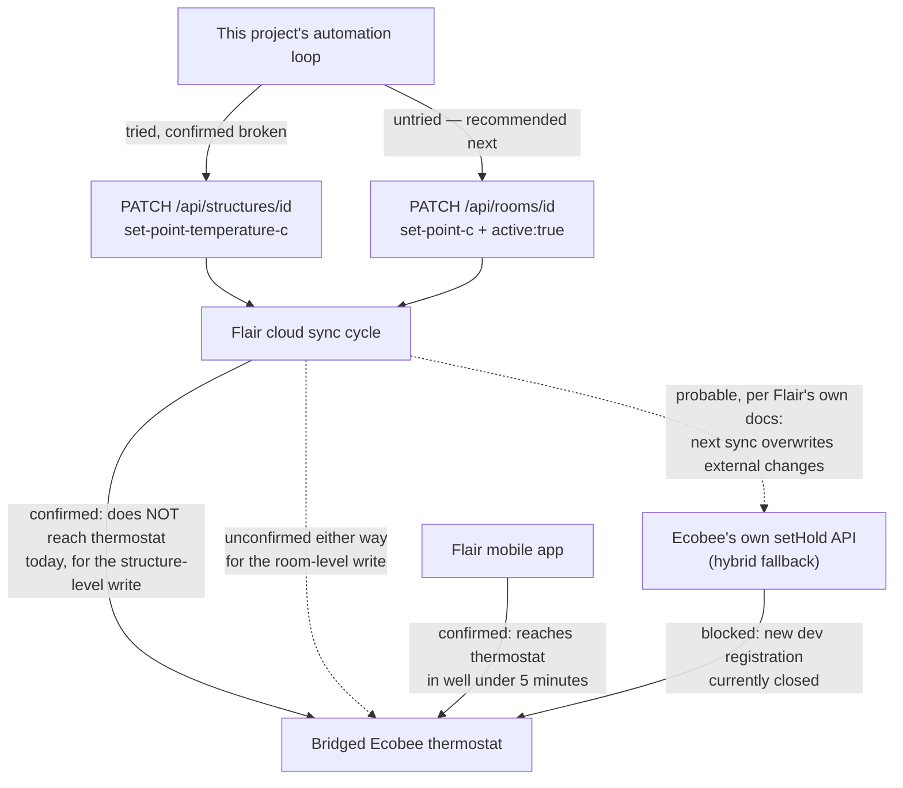

# Flair Setpoint Propagation Research

- [Flair Setpoint Propagation Research](#flair-setpoint-propagation-research)
  - [How this was gathered](#how-this-was-gathered)
  - [1. Flair's official developer API documentation](#1-flairs-official-developer-api-documentation)
    - [1a. Writable fields other than `set-point-temperature-c`](#1a-writable-fields-other-than-set-point-temperature-c)
    - [1b. A "hold" resource type or relationship](#1b-a-hold-resource-type-or-relationship)
    - [1c. A sync / force-refresh / action endpoint](#1c-a-sync--force-refresh--action-endpoint)
    - [1d. `PATCH /api/thermostats/{id}` as a separate write path](#1d-patch-apithermostatsid-as-a-separate-write-path)
  - [2. Other real integrations writing a Flair structure setpoint](#2-other-real-integrations-writing-a-flair-structure-setpoint)
  - [3. Community reports of the same symptom](#3-community-reports-of-the-same-symptom)
  - [4. Reverse-engineered Flair mobile app traffic](#4-reverse-engineered-flair-mobile-app-traffic)
  - [5. Hybrid fallback: writing holds directly via Ecobee's own API](#5-hybrid-fallback-writing-holds-directly-via-ecobees-own-api)
    - [Ecobee developer registration status](#ecobee-developer-registration-status)
    - [Ecobee's own hold mechanism](#ecobees-own-hold-mechanism)
    - [Ecobee API rate limits and licensing terms](#ecobee-api-rate-limits-and-licensing-terms)
    - [Would Flair's own SPC mode overwrite an externally-set Ecobee hold?](#would-flairs-own-spc-mode-overwrite-an-externally-set-ecobee-hold)
  - [Assessment](#assessment)

## How this was gathered

Primary sources attempted first, per the task's own methodology: Flair's official Postman-hosted API reference (the same document already used in `docs/flair-api-schema.md`), Flair's own marketing/compatibility pages, Ecobee's own developer documentation and licensing agreement, and direct GitHub code/issue search across real third-party Flair client implementations. `support.flair.co` (both Help Center articles and Community posts) returned `403 Forbidden` to every fetch attempt made in this pass — direct `WebFetch`, a `curl` with a browser User-Agent, and the `r.jina.ai` reader proxy — consistent with the same Cloudflare-blocking behavior already documented in `docs/flair-api-schema.md`'s OAuth research section. Where a `support.flair.co` page's content is cited below, it is cited **only from a web-search engine's summarized snippet of that page, not from the raw page itself** — this is flagged explicitly on every such claim and its confidence tier is capped accordingly, never treated as equivalent to a directly-fetched primary source.

## 1. Flair's official developer API documentation

**Source attempted**: Flair's own official Postman-published API reference, "Flair API" (owner id `5353571`, published id `TzsbKTAG`): [documenter.getpostman.com/view/5353571/TzsbKTAG](https://documenter.getpostman.com/view/5353571/TzsbKTAG), and the underlying published collection JSON, [documenter.gw.postman.com/api/collections/5353571/TzsbKTAG](https://documenter.gw.postman.com/api/collections/5353571/TzsbKTAG?segregateAuth=true&versionTag=latest) (~227 KB, every endpoint's full description text) — the same document already used for the OAuth research in `docs/flair-api-schema.md`.

### 1a. Writable fields other than `set-point-temperature-c`

**Confirmed, from the collection JSON**: the documented `PATCH /api/structures/{id}` example ("Example: Change Schedule") shows `mode` (auto/manual), `structure-heat-cool-mode` (cool/heat/auto/float), `active-schedule-id`, and `callback-url` as writable fields alongside the example payload. **The collection's own worked example does not include `set-point-temperature-c` at all** — meaning Flair's own official documentation never explicitly demonstrates the exact write this project's support ticket made, even though the live API accepts it (already confirmed in `docs/flair-support-ticket-setpoint-propagation.md`). This is a real documentation gap, not a contradiction — it just means "does `set-point-temperature-c` need a sibling field to take effect" cannot be answered from Flair's own docs one way or the other; the docs simply don't discuss this exact field's write semantics.

**Confirmed, from real third-party client code (a stronger source than the docs gap above)**: a **second, genuinely distinct writable setpoint field exists and is used in production** — `rooms.set-point-c` (per-room, not per-structure), always paired with `active: true` in the one payload shape every client examined uses. Found in two independent, real, currently-referenced repos:

- `RobertD502/home-assistant-flair` (the same repo already cited in the support ticket for the structure-level write), `custom_components/flair/climate.py`, class `RoomTemp.async_set_temperature`:
  ```python
  attributes = {"set-point-c": value, "active": True}
  await self.coordinator.client.update('rooms', self.room_data.id, attributes=attributes, relationships={})
  ```
  [github.com/RobertD502/home-assistant-flair/blob/main/custom_components/flair/climate.py](https://github.com/RobertD502/home-assistant-flair/blob/main/custom_components/flair/climate.py)
- `RobertD502/hass-flair-helper` (an older, precursor project by the same author), `flair/rooms/room.py`, method `set_temperature`, identical shape: `{'set-point-c': temp, 'active': True}`, PATCHed against the `rooms` resource. This file's own commented-out real API dump also shows a live example value, `'set-point-c': 20.0`, alongside `'hold-reason': 'Set by Robert'` — confirming Flair itself attributes a per-room hold to the human who set it, distinct from the structure-level hold discussed in 1b below. [raw.githubusercontent.com/RobertD502/hass-flair-helper/main/flair/rooms/room.py](https://raw.githubusercontent.com/RobertD502/hass-flair-helper/main/flair/rooms/room.py)

**Confidence: confirmed** that `rooms.set-point-c` is a real, distinct, writable field, separate from `structures.set-point-temperature-c` — this project's own live test (in `docs/flair-support-ticket-setpoint-propagation.md`) only exercised the structure-level field, never the room-level one. **Speculative**: whether writing the room-level field for the specific room containing the bridged thermostat (per `docs/flair-api-schema.md`, that's room "Den Front" on this account) would propagate any differently than the structure-level write did — genuinely untested, by this project or (as far as this research found) by anyone reporting a bridged/staged-Ecobee configuration specifically. See the [Assessment](#assessment) for why this is nonetheless the recommended next experiment.

No mode field, no separate heat/cool setpoint pair, and no explicit "hold-type" field were found anywhere in the documentation for either `structures` or `thermostats` — consistent with this account's own `structures.use-single-set-point: true` finding already in `docs/flair-api-schema.md`.

### 1b. A "hold" resource type or relationship

**Not found — confirmed absent, not just unexplored.** Neither the Postman collection (full-text searched for "hold") nor a GitHub code search across every Flair client repo examined (`gh search code "\"type\":\"holds\""`, zero results; `gh search code "PATCH api/thermostats"`, zero results) turned up a dedicated `holds` resource type or a create-a-hold-object endpoint anywhere in Flair's API. Flair's hold model is **attribute-based, not object-based**: `hold-reason`, `hold-until`, `hold-until-schedule-event`, and `default-hold-duration` all appear as plain attributes on `structures` and `rooms` (confirmed via the real API dumps in `RobertD502/hass-flair-helper`'s `room.py`, quoted in 1a above — e.g. `'hold-reason': 'thermostat'` at the structure level, `'default-hold-duration': 'Until'`). This is a materially different model from Ecobee's own native API, which does model a schedule override as a created `Event` object via the `setHold` function (see [Section 5](#5-hybrid-fallback-writing-holds-directly-via-ecobees-own-api)) — Flair has no equivalent "create a hold resource" call; a "hold" on the Flair side is just whatever value currently sits in `set-point-temperature-c`/`set-point-c` plus its accompanying `hold-*` attributes.

### 1c. A sync / force-refresh / action endpoint

**Not found.** A full-text search of the entire Postman collection JSON (the same file already scanned for OAuth/rate-limit terms in `docs/flair-api-schema.md`) for endpoints or descriptions containing "sync," "refresh," "force," or "action" returned nothing resembling a dedicated push/resync call. No GitHub client examined implements or calls one either. **Confirmed absent from the primary documentation searched — not ruled out as existing but undocumented.**

### 1d. `PATCH /api/thermostats/{id}` as a separate write path

**Not found — confirmed absent from both the docs and every real client examined.** The Postman collection documents no PATCH/POST operation for `/api/thermostats/{id}`, only GET-shaped read access. Every third-party client's write calls target `structures`, `rooms`, `pucks`, `vents`, `bridges`, or `hvac-units` — never `thermostats` directly (confirmed across `bassrock/node-flair-api-ts`, `RobertD502/home-assistant-flair`, `RobertD502/hass-flair-helper`, `scottrpoulin/flair-vent-controller`, `UniversalDevicesInc-PG3/udi-flair-polyglot`). **Thermostats appear to be a read-only resource in Flair's API as actually used by every integration found** — there is no alternate thermostat-level write path documented or implemented anywhere.

## 2. Other real integrations writing a Flair structure setpoint

GitHub code search (`gh search code "set-point-temperature-c"`) found these additional real integrations beyond `RobertD502/home-assistant-flair`, all using the identical structure-level payload shape (`{"set-point-temperature-c": value}`, no other fields):

| Repo | File | Notes |
|---|---|---|
| `scottrpoulin/flair-vent-controller` | `MyFlair.py` | Read-only in the snippet found (`.get('set-point-temperature-c')`); write path not confirmed present. |
| `bassrock/node-flair-api-ts` | `src/client.ts` | A general-purpose TypeScript client library, not an end-user app — writes `'set-point-temperature-c': setPointC` but has no way to independently confirm any specific user's real thermostat behavior. |
| `UniversalDevicesInc-PG3/udi-flair-polyglot` | `flair_poly.py` | A Universal Devices ISY994i/Polyglot node server integration; reads the field, write path not confirmed present in the code found. |
| `RobertD502/hass-flair-helper` | (structure-level, precursor project) | Same author as `home-assistant-flair`; real API dump confirms `set-point-mode: "Home Evenness For Active Rooms Follow Third Party"` as a second real SPC-mode string value, distinct from this project's own account's `"...Flair Setpoint"` mode. |

**Confidence: confirmed** that the payload shape is consistent across every real integration found — this corroborates, but does not exceed, what `docs/flair-support-ticket-setpoint-propagation.md` already established about `RobertD502/home-assistant-flair`. **Not found**: any GitHub issue, discussion, or README across these repos in which a user explicitly confirms (rather than merely uses without erroring) that a structure-level setpoint write reached their real, physical thermostat specifically under a bridged/staged third-party configuration like this project's Bosch/Ecobee setup. A targeted search of `RobertD502/home-assistant-flair`'s own issues for "ecobee setpoint" found only one tangential, unrelated issue (#30, a 422 error when changing a puck-associated thermostat's setpoint while powered off, closed without public root-cause discussion) — nothing confirming or denying real-world propagation success under any specific hardware configuration.

## 3. Community reports of the same symptom

Direct retrieval of `support.flair.co` pages was blocked (`403 Forbidden`) for every method tried — see [How this was gathered](#how-this-was-gathered). The following is reconstructed from search-engine snippets only, and is capped at **probable** confidence at best, never "confirmed," since the underlying pages could not be independently read:

- **"Set Point Controller" (official Help Center article)** — [support.flair.co/hc/en-us/articles/360000533631-Set-Point-Controller](https://support.flair.co/hc/en-us/articles/360000533631-Set-Point-Controller) (inaccessible directly; summarized via search snippet). States there are exactly two SPC modes, "Thermostat" and "Flair App," and — most relevant to this research — that under "Flair App" mode, **"you should not make set point or mode changes on your Smart Thermostat as these will interfere with Flair and will likely be overwritten by Flair."** This is the single most load-bearing community-adjacent finding in this research pass; see [Section 5](#5-hybrid-fallback-writing-holds-directly-via-ecobees-own-api) for why. **Confidence: probable** — this is Flair's own official guidance, but reached only through a search snippet, not a verified raw fetch of the article.
- **"Ecobee not working as expected with Flair"** — [support.flair.co/hc/en-us/community/posts/4422365621517](https://support.flair.co/hc/en-us/community/posts/4422365621517-Ecobee-not-working-as-expected-with-Flair) — title strongly suggests the same symptom class, but page content could not be retrieved by any method tried. **Not found** (inaccessible, not evaluated).
- **"Cannot get thermostat to set itself to set point to heat a room"** — [support.flair.co/hc/en-us/community/posts/360077230591](https://support.flair.co/hc/en-us/community/posts/360077230591-Cannot-get-thermostat-to-set-itself-to-set-point-to-heat-a-room) — title also strongly suggests the same symptom class. **Not found** (inaccessible, not evaluated).
- **"Set Point Linking"** (a distinct setting, Home Settings > Thermostats > Ecobee, from a related but different post, [support.flair.co/hc/en-us/community/posts/360048114051](https://support.flair.co/hc/en-us/community/posts/360048114051-Ecobee-as-setpoint-controller-but-still-set-Flair-room-temps-)) — per search-snippet summary, this setting governs the **opposite** direction of control (Ecobee as SPC, individual Flair rooms/pucks also trying to adjust the Ecobee setpoint) from this project's own configuration (SPC = "Flair App"). **Flagged as adjacent context, not a direct explanation** — this project's account is not in the configuration this setting addresses, so disabling/enabling it is not expected to be relevant on its own. **Confidence: probable, low relevance.**
- **No Reddit thread** (r/flairvents does not appear to exist as an active, indexed subreddit; r/ecobee was searched directly) reporting this exact symptom was found by any search query tried. **Confirmed not found**, not merely unsearched — several differently-worded queries were tried.

## 4. Reverse-engineered Flair mobile app traffic

**Not found.** No mitmproxy/Charles Proxy writeup, blog post, gist, or forum thread documenting a capture of the real Flair mobile app's own network traffic when a user changes the home setpoint was located by any search query tried (multiple phrasings attempted: "mitmproxy Flair app," "reverse engineer Flair API app traffic," etc.). This should be treated as a genuine gap in publicly available information, not as evidence either way about what the app does differently from the documented REST API.

## 5. Hybrid fallback: writing holds directly via Ecobee's own API

### Ecobee developer registration status

**Confirmed, directly fetched**: Ecobee's own developer page currently states, verbatim: **"Sorry, we are not currently accepting new developer registrations at this time."** — [ecobee.com/en-us/developers/](https://www.ecobee.com/en-us/developers/), fetched directly in this research pass. This is corroborated by two independent, dated community sources: a Home Assistant community thread titled "Ecobee not taking new registrations?" from October 2024 ([community.home-assistant.io/t/ecobee-not-taking-new-registrations/786313](https://community.home-assistant.io/t/ecobee-not-taking-new-registrations/786313)), and a GitHub issue dated January 24, 2026 explicitly stating "it is not possible to create a developer account thus get API key required for the integration setup" ([github.com/home-assistant/home-assistant.io/issues/43234](https://github.com/home-assistant/home-assistant.io/issues/43234)). **This is a sustained closure of over a year, still in effect as of the most recent source found (January 2026) — not a brief outage.** For a single personal account with no pre-existing developer app, this closes off the hybrid-fallback path entirely at the registration step, before any OAuth or rate-limit question even becomes relevant.

**Worth flagging, not a confirmed workaround**: Home Assistant's own official `ecobee` integration changed, as of HA version 2026.3, to **no longer require users to supply their own developer API key at all** — it authenticates with the user's plain ecobee.com username/password instead ([home-assistant.io/integrations/ecobee/](https://www.home-assistant.io/integrations/ecobee/)). This strongly implies Home Assistant itself now holds some form of pre-registered/shared access that individual users piggyback on, rather than each user registering their own app — but nothing found confirms the mechanism, and it is specific to Home Assistant Core's own integration, not something a standalone script or this project's own backend could straightforwardly replicate without either building on top of Home Assistant itself or independently negotiating something equivalent with Ecobee. **Confidence: probable that this exists as stated; speculative that it is replicable for this project's own use case.**

### Ecobee's own hold mechanism

**Confirmed, directly fetched**: Ecobee's official `setHold` function documentation ([developer.ecobee.com](https://developer.ecobee.com/home/developer/api/documentation/v1/functions/SetHold.shtml), and the earlier alias `www.ecobee.com/home/developer/api/documentation/v1/functions/SetHold.shtml`) confirms the hold-as-created-Event model referenced in this task's own background: `setHold` takes `coolHoldTemp`/`heatHoldTemp`/`holdClimateRef`/`fanSpeed`, and a `holdType` of `dateTime`, `nextTransition`, `indefinite`, or `holdHours`. An indefinite hold requires an explicit `ResumeProgram` call to cancel. This is confirmed to be structurally different from Flair's own model (see [1b](#1b-a-hold-resource-type-or-relationship) above) — Ecobee creates a distinct Event/hold object; Flair only ever writes plain attributes.

### Ecobee API rate limits and licensing terms

**Confirmed, directly fetched**, from Ecobee's own Licensing Agreement ([ecobee.com/home/developer/api/introduction/licensing-agreement.shtml](https://www.ecobee.com/home/developer/api/introduction/licensing-agreement.shtml)):

- Rate limit: **"Your Implementation may not request queries from the Services at a rate greater than 1 request per second per thermostat."** Exceeding it returns HTTP 429.
- Free monthly usage cap: **85,000 queries per month** at no cost — far more than a single-thermostat home-automation polling loop would need.
- Paid tiers exist above that cap (e.g., $500 USD/year for +170,000 additional queries/month), but a single-thermostat personal use case is very unlikely to approach the free 85,000/month ceiling.
- **The agreement explicitly applies to both commercial and non-commercial use** — there is no separate, lighter-weight "personal use" tier; a verified non-profit is the only stated exemption from the usage cap. This means even a hobbyist single-account integration is bound by the same commercial licensing agreement as a partner integration, though the actual limits (1 req/sec/thermostat, 85k/month free) are generous enough not to matter in practice for one thermostat.

### Would Flair's own SPC mode overwrite an externally-set Ecobee hold?

**Probable, not confirmed** — this is the single most consequential open question for the hybrid-fallback approach, and no source found tested it directly (i.e., nobody was found who set an Ecobee hold via Ecobee's own API while Flair's SPC was simultaneously "Flair App" and reported what happened on Flair's next sync cycle). The best available evidence is indirect but points the same direction from two independent angles:

1. Flair's own official Help Center guidance (Section 3 above, capped at "probable" confidence due to the fetch-access limitation) states outright that manual changes made directly on the smart thermostat "will likely be overwritten by Flair" under SPC = "Flair App." An Ecobee-API-created hold changes the exact same underlying thermostat state (`target-temperature-c` / the active hold) that a manual on-device change does — Flair's own sync logic has no documented way to distinguish "a human turned the dial" from "an API call created a hold," since both simply change what the thermostat reports back to Flair on its next poll.
2. This project's own confirmed, isolated live test (`docs/flair-support-ticket-setpoint-propagation.md`) already showed a real Flair↔Ecobee sync cycle ran and yet the thermostat's `target-temperature-c` never moved to match Flair's own pushed structure-level value — i.e., under this account's specific configuration, Flair's sync cycle is not reliably *asserting* its own value onto the thermostat at all right now. If that finding generalizes, it could cut the other way: a Flair sync cycle that isn't successfully writing to the thermostat can't very well overwrite something else either. **This is speculative** and holds only if the propagation failure itself is a structural, ongoing bug on Flair's side (plausible, but not established) rather than a difference triggered specifically by this project's own API-vs-app write path (also plausible, and the ticket's whole premise).

**Net finding**: not confirmed either way from any source, but the balance of evidence (Flair's own documented "will be overwritten" warning) leans toward **Flair's own SPC="Flair App" mode being designed to actively reassert its own value over anything else that changes the thermostat's setpoint**, which would make a direct-Ecobee-hold hybrid fallback fragile at best unless SPC mode is switched away from "Flair App" first — a change with its own, larger consequences for this project's whole control design (Flair's home-evenness/room-balancing logic is explicitly gated on that same SPC setting per `docs/flair-api-schema.md`'s `set-point-mode` finding).

## Assessment

**Do not build the Ecobee-hybrid-hold fallback next.** Two independent, confirmed blockers make it the wrong next step even before considering the SPC-overwrite risk: (1) Ecobee is not currently accepting new developer registrations — a sustained, 15+ month closure as of the most recent source found — so this project cannot even obtain the credentials the fallback needs today without piggybacking on some other party's existing registration (unconfirmed as replicable); and (2) even if credentials existed, Flair's own official documentation states that SPC = "Flair App" mode is *designed* to overwrite exactly the kind of external thermostat change a directly-set Ecobee hold would be. Pursuing this path now means building a fragile, licensing-encumbered integration against a registration wall, aimed at a target that Flair's own SPC logic is documented to fight — a bad trade for a home-automation project.

**The single most promising next step is free, fast, and untried: write the setpoint via `PATCH /api/rooms/{id}` with `{"set-point-c": <value>, "active": true}` for the room containing the bridged thermostat (room "Den Front," per `docs/flair-api-schema.md`), instead of `PATCH /api/structures/{id}`.** This is not a guess — it is the literal, verbatim write path used in production by two independently-written, real client implementations (`RobertD502/home-assistant-flair`'s current `climate.py`, and its own precursor `hass-flair-helper`), both distinct from the structure-level write this project's own support ticket already tried and found broken. Nothing in this research found any evidence this room-level path has been tried, confirmed, or ruled out for a bridged/staged third-party thermostat — it is a genuinely different, previously-untested mechanism, reachable with the OAuth scopes this project already holds, costing nothing but a second isolated live test structured exactly like the one already documented in `docs/flair-support-ticket-setpoint-propagation.md`.

**In parallel, escalate the open Flair support ticket with two new, pointed questions this research surfaced that Flair's own support team is the only party who can authoritatively answer**: (a) does a per-room `set-point-c` write propagate to a bridged thermostat differently than the structure-level `set-point-temperature-c` write did in the account's own isolated test; and (b) is SPC = "Flair App" mode's sync cycle expected to actively reassert its own value over any externally-changed thermostat state (including an API-driven hold, not just a manual on-device change) — since the answer to (b) is what determines whether the Ecobee-hybrid path would ever be viable even after Ecobee's registration freeze eventually lifts.



**If (and only if) the room-level write also fails to propagate**, the next reasonable move is not the Ecobee-hybrid path but a second, cheaper support-ticket escalation asking Flair to explain the gap directly — this project has now exhausted every write shape its own research and every real third-party client examined actually uses in production.
