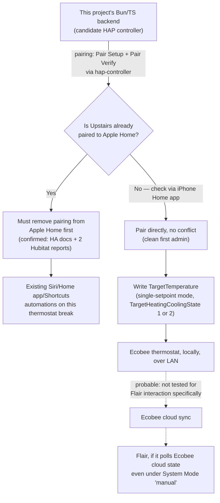

# HomeKit Ecobee Control Research

- [HomeKit Ecobee Control Research](#homekit-ecobee-control-research)
  - [How this was gathered](#how-this-was-gathered)
  - [1. Mapping `aresSmart` to a retail product, and its HomeKit support](#1-mapping-aressmart-to-a-retail-product-and-its-homekit-support)
  - [2. How HomeKit pairing and control actually works for a non-Apple client](#2-how-homekit-pairing-and-control-actually-works-for-a-non-apple-client)
    - [2a. Where the Setup Code actually lives for an already-set-up unit](#2a-where-the-setup-code-actually-lives-for-an-already-set-up-unit)
    - [2b. Multiple simultaneous admin controllers — the central practical question](#2b-multiple-simultaneous-admin-controllers--the-central-practical-question)
    - [2c. What the HAP `Thermostat` service actually exposes](#2c-what-the-hap-thermostat-service-actually-exposes)
  - [3. Real Node.js/TypeScript libraries for acting as a HomeKit controller](#3-real-nodejstypescript-libraries-for-acting-as-a-homekit-controller)
  - [4. Does HomeKit control sidestep Flair's Set Point Controller?](#4-does-homekit-control-sidestep-flairs-set-point-controller)
  - [5. Real gotchas and failure reports controlling an Ecobee via HomeKit](#5-real-gotchas-and-failure-reports-controlling-an-ecobee-via-homekit)
  - [Assessment](#assessment)

## How this was gathered

Primary sources attempted first, per this repo's own research convention: Ecobee's own product/marketing pages, Apple's own support documentation, the `home-assistant/core` repository's source (fetched raw, not summarized), the npm registry's own API (not the rendered npmjs.com page, which returned inconsistent scrapes), and the `Apollon77/hap-controller-node` GitHub repository. Where a primary source could not be fetched directly (Apple's own HomeKit Accessory Protocol Specification is not published anywhere publicly accessible — Apple gates it behind the paid MFi/"Works with Apple Home" developer program, and no legitimately-hosted copy was found), this is stated as "not found," and the claim is instead sourced to a real, working open-source HAP implementation's own code (`HAP-NodeJS`, `hap-controller-node`) or to real first-hand user reports (Home Assistant GitHub issues, Hubitat community forum posts) — each capped at the confidence tier appropriate to that kind of source, never treated as equivalent to Apple's own spec text. Community forum threads (`community.hubitat.com`, `community.home-assistant.io`) were read in full via direct fetch, not just search-snippet summaries, specifically because this question's most important finding (single-admin pairing) turned out to live almost entirely in first-hand user reports rather than in any documentation page.

## 1. Mapping `aresSmart` to a retail product, and its HomeKit support

**Confirmed**, directly from `home-assistant/core`'s own source, fetched raw (not a rendered/cached copy): the `ECOBEE_MODEL_TO_NAME` dictionary in `homeassistant/components/ecobee/const.py` maps:

```python
ECOBEE_MODEL_TO_NAME = {
    "idtSmart": "ecobee Smart",
    "idtEms": "ecobee Smart EMS",
    "siSmart": "ecobee Si Smart",
    "siEms": "ecobee Si EMS",
    "athenaSmart": "ecobee3 Smart",
    "athenaEms": "ecobee3 EMS",
    "corSmart": "Carrier/Bryant Cor",
    "nikeSmart": "ecobee3 lite Smart",
    "nikeEms": "ecobee3 lite EMS",
    "apolloSmart": "ecobee4 Smart",
    "vulcanSmart": "ecobee4 Smart",
    "aresSmart": "ecobee Smart Premium",
    "artemisSmart": "ecobee Smart Enhanced",
    "attisRetail": "ecobee Smart Thermostat with Voice Control",
    "attisPro": "ecobee Smart Thermostat Lite",
}
```

**Source**: [`home-assistant/core`](https://github.com/home-assistant/core), file [`homeassistant/components/ecobee/const.py`](https://github.com/home-assistant/core/blob/dev/homeassistant/components/ecobee/const.py), fetched directly via `raw.githubusercontent.com` and independently re-confirmed with a second `curl` pass in this same session. This directly answers the task's request to find a model-mapping table the way `python-ecobee-api`/Home Assistant maintain one — Home Assistant's own `ecobee` (cloud) integration source turned out to be exactly that table, more directly than either `pyecobee` (`sherif-fanous/Pyecobee`) or `python-ecobee-api` (`nkgilley/python-ecobee-api`), neither of which was found (via GitHub code search) to carry its own copy of this mapping.

**Corroborating, independent confirmation (probable, not primary)**: [`home-assistant/core` issue #73717](https://github.com/home-assistant/core/issues/73717), "Unrecognized model number: aresSmart" (filed 2022), describes the reporting user's device as a "brand new ecobee Premium" — consistent with the const.py mapping above and dated to the same 2022 product launch. The Indigo Domotics "Ecobee 2" plugin store listing ([indigodomo.com/pluginstore/193](https://www.indigodomo.com/pluginstore/193/)) independently lists `aresSmart` as the internal id it added support for under the name "Premium," a second, differently-authored source landing on the same mapping.

**What retail product this is today — probable, with a naming nuance flagged, not glossed over**: Ecobee's naming has moved since the 2022 launch. The product `aresSmart` maps to was launched and initially marketed simply as "ecobee Smart Premium" / "ecobee Premium" (per the sources above), but the currently-sold product occupying that position in Ecobee's lineup is now branded **"Smart Thermostat Premium"** (alongside a separate "Smart Thermostat Enhanced," `artemisSmart` per the same table). **Not confirmed** in this pass: whether "Smart Thermostat Premium" (current) and "ecobee Smart Premium" (2022, `aresSmart`) are the exact same hardware/firmware revision under a renamed SKU, or a genuinely later hardware revision that Home Assistant's own mapping hasn't been updated to distinguish — the const.py table gives no version/date information, only a name string. Given this project's own established context (Flair reports `thermostat-model: "aresSmart"` for a physical unit installed and in active use in this house today), this doc treats `aresSmart` = the 2022-era "ecobee Smart Premium" / current "Smart Thermostat Premium" lineage as **probable**, not confirmed as an exact SKU match.

**Apple's own HomeKit compatibility for this product — confirmed, but from Ecobee's own marketing page rather than a still-live independent Apple compatibility page**: Ecobee's own current product page states directly: *"Works with the platforms you already use, including Apple HomeKit, Amazon Alexa, Google Assistant, and SmartThings."* — [ecobee.com/en-us/smart-thermostats/smart-thermostat-premium/](https://www.ecobee.com/en-us/smart-thermostats/smart-thermostat-premium/), fetched directly. Apple's own shop also carries this exact product under its HomeKit accessories storefront — [apple.com/shop/accessories/all/homekit/ecobee](https://www.apple.com/shop/accessories/all/homekit/ecobee) and the specific product page [apple.com/shop/product/hq2e2zm/a/ecobee-smart-thermostat-premium-with-siri-and-built-in-air-quality-monitor](https://www.apple.com/shop/product/hq2e2zm/a/ecobee-smart-thermostat-premium-with-siri-and-built-in-air-quality-monitor) — being sold through Apple's own storefront specifically for HomeKit accessories is treated here as **probable** corroboration (Apple does not sell non-HomeKit-compatible accessories under that storefront path), not as a fetched, explicit "Works with Apple Home" badge quote — the product page's compatibility copy itself did not render in a directly fetchable form in this pass (only nav/footer content came back); this specific gap is marked **not found** rather than assumed.

**Historical grounding, confirmed**: Ecobee's own press release states the **ecobee3** (a much earlier model, `athenaSmart` per the table above) was *"the world's first HomeKit-enabled smart thermostat"* — [ecobee.com/en-us/newsroom/press-releases/ecobee-announces-worlds-first-homekit-enabled-smart-thermostat/](https://www.ecobee.com/en-us/newsroom/press-releases/ecobee-announces-worlds-first-homekit-enabled-smart-thermostat/), fetched directly — confirming HomeKit support has been a continuous feature of every Ecobee smart-thermostat generation since 2016, not a recent or optional add-on for the Premium specifically.

## 2. How HomeKit pairing and control actually works for a non-Apple client

### 2a. Where the Setup Code actually lives for an already-set-up unit

**Probable, converging from several independent real-user accounts, not from one authoritative doc**: the 8-digit Setup Code for an Ecobee thermostat is not a one-time, initial-setup-only screen — it remains accessible later, generated on-demand:

- A real Hubitat community driver author, describing building a from-scratch HAP-controller integration against a real Ecobee, states the working procedure is to **"Generate the 8-digit HomeKit setup code on the thermostat immediately before pairing and Save promptly"** — implying it's produced live from the device's own on-screen menu, not read off a static sticker, and that it expires/rotates if you wait too long. — [community.hubitat.com/t/release-cloud-free-ecobee-hap-thermostat-local-direct-control-of-an-ecobee-from-any-hub-c5-c7-c8-no-apple-hardware/164746](https://community.hubitat.com/t/release-cloud-free-ecobee-hap-thermostat-local-direct-control-of-an-ecobee-from-any-hub-c5-c7-c8-no-apple-hardware/164746)
- A second, independent real-user report (an Ecobee3 Lite owner using Home Assistant + Hubitat for the same kind of local pairing) confirms the same practical procedure: **"obtain the HomeKit pairing code from the Ecobee's LCD screen during the pairing process."** — [community.hubitat.com/t/am-i-crazy-local-control-of-ecobee/136399](https://community.hubitat.com/t/am-i-crazy-local-control-of-ecobee/136399)
- A secondary how-to source describes a second, app-mediated path specifically for adding an Ecobee to a *first* HomeKit home: **ecobee App → select the thermostat → Settings → HomeKit → Add to HomeKit**, which surfaces a QR code encoding the same setup code. — [addtohomekit.com/blog/ecobee-homekit](https://www.addtohomekit.com/blog/ecobee-homekit/) (secondary source, capped at **probable**)
- Home Assistant's own official `homekit_controller` integration docs describe the general HAP norm, consistent with the above: **"The code is on the device itself, or on the packaging. If your device has a screen, it may be shown on screen."** — [home-assistant.io/integrations/homekit_controller/](https://www.home-assistant.io/integrations/homekit_controller/), fetched directly. **Confirmed** as Home Assistant's own stated general behavior, not Ecobee-specific.

**Net, practical answer to the task's question**: for a unit already in daily use (like the real "Upstairs" thermostat), the code is expected to be reachable via the thermostat's own on-screen Settings menu (or the ecobee app's Settings → HomeKit screen) on demand, not lost forever after initial setup — but every source found describing this is a real-user account or a secondary how-to, not Ecobee's own developer documentation stating it as a guarantee. Treat as **probable**, confirm on the actual unit before relying on it.

### 2b. Multiple simultaneous admin controllers — the central practical question

This is the most consequential finding in this research pass, and it does **not** favor the hoped-for outcome.

**Confirmed, from the protocol/implementation side**: the HAP pairing protocol does define a mechanism for an accessory to hold more than one paired controller at once. `Apollon77/hap-controller-node`'s own pairing implementation exposes `buildAddPairingM1`, `buildRemovePairingM1`, and `buildListPairingsM1` methods, with an `isAdmin` parameter on the add-pairing call — confirming "Add Pairing" (adding a second/third controller without erasing the first) is a real, implemented part of the protocol, not a theoretical spec-only feature. — [`Apollon77/hap-controller-node`](https://github.com/Apollon77/hap-controller-node), `src/protocol/pairing-protocol.ts`, fetched directly.

**Confirmed, from real-world practice, that this mechanism is not reachable by an arbitrary independent third-party controller in the way this project would need**: every real account found — official documentation and first-hand user reports alike — describes the opposite practical experience for a device already paired to Apple's Home app:

- Home Assistant's own official integration docs state, in its own words: **"Make sure the device is on your network, but not paired with another HomeKit controller."** and, for a device already in Apple Home: **"Remove the device from the Apple Home app. Otherwise you won't be able to pair it with Home Assistant."** and, most directly: **"HomeKit devices can only be paired to a single controller at once."** — [home-assistant.io/integrations/homekit_controller/](https://www.home-assistant.io/integrations/homekit_controller/), fetched directly. **Confirmed.**
- A real first-hand Hubitat user (Ecobee Lite 3 owner) states the identical practical requirement for their own working setup: **"In order to use the Ecobee↔HomeAssistant↔Hubitat all local setup, you must first remove the Ecobee Thermostat from your 'Apple Home'."** — [community.hubitat.com/t/am-i-crazy-local-control-of-ecobee/136399](https://community.hubitat.com/t/am-i-crazy-local-control-of-ecobee/136399). **Confirmed**, first-hand.
- The Hubitat Ecobee-HAP driver author (Section 2a) describes the same constraint in his own words: HomeKit pairing is effectively single-admin in practice — an accessory already in Apple Home has to be removed from Apple Home before his driver's own from-scratch HAP client can complete Pair Setup against it; afterward, it can optionally be re-exposed back to Apple Home only by proxying it *through* the new controller (Hubitat's own bridge), not by holding two truly independent pairings side by side. — [community.hubitat.com/t/release-cloud-free-ecobee-hap-thermostat-local-direct-control-of-an-ecobee-from-any-hub-c5-c7-c8-no-apple-hardware/164746](https://community.hubitat.com/t/release-cloud-free-ecobee-hap-thermostat-local-direct-control-of-an-ecobee-from-any-hub-c5-c7-c8-no-apple-hardware/164746). **Confirmed**, first-hand, from someone who built the exact kind of client this project is considering building.

**Reconciling the two halves — why this is (protocol capability) vs. how it plays out (practice)**: the "Add Pairing" mechanism exists specifically so that *an already-paired admin controller* can vouch for and add a second controller without a fresh Pair Setup — this is exactly the mechanism Apple's own Home app uses internally when a household member is invited to share a home (Apple's own support page describes this as **"Add People"** in the Home app, gated by Apple Account/iCloud identity, not a generic "pair a second, arbitrary third-party client" flow). — [support.apple.com/en-us/102386](https://support.apple.com/en-us/102386), fetched directly. **Confirmed**: Apple's own Home app has no exposed flow for using Add Pairing to admit a non-Apple, non-iCloud-invited custom controller as a co-admin alongside itself. **Speculative, not tested by any source found**: whether a custom controller could reach the Add Pairing flow some other way (e.g. if the household's own Apple Home app / a HomeKit hub could be scripted or MITM'd into issuing the Add Pairing request on the custom controller's behalf) — nothing found describes anyone doing this for any accessory, Ecobee or otherwise; treat as **not found**, not merely difficult.

**Bottom line for this project's specific situation**: if the real "Upstairs" Ecobee is *not currently paired to any Apple Home* (plausible — nothing in this project's own established context confirms it is; only that its HAP service is *advertising*, which a HAP accessory does whether paired or unpaired), a custom backend can likely pair to it directly and immediately, with no conflict to resolve — a clean win. If it *is* already paired to an Apple Home (an iPhone, HomePod, or Apple TV in the house), every source found agrees the practical path is to remove that pairing first, which would also remove it from whatever iOS Home app/Siri/Shortcuts automations currently depend on it. **This is a concrete, checkable fact, not a coin flip** — HAP's Bonjour TXT record includes a status-flag byte whose bit 0 indicates paired vs. unpaired; **not found** in this pass was a clean, directly-fetchable primary citation for the exact bit semantics (Apple's own HAP spec, again, is the authoritative source and isn't publicly hosted) — but the practical, zero-cost next step is simply to check the household's own iPhone Home app for whether "Upstairs" (or the physical Ecobee) already appears there, which settles the question directly without needing the spec at all.

### 2c. What the HAP `Thermostat` service actually exposes

**Confirmed**, from a real, widely-used open-source HAP accessory implementation's own service definitions (a strong practical stand-in for Apple's non-public spec, used here specifically because HAP-NodeJS's service/characteristic UUIDs and requirement lists are themselves validated against real Apple-certified accessories and real iOS Home app behavior as a condition of that project's own existence): the `Thermostat` service (UUID `0000004A-0000-1000-8000-0026BB765291`) declares:

| Characteristic | Required? |
|---|---|
| `CurrentHeatingCoolingState` | Required |
| `TargetHeatingCoolingState` | Required |
| `CurrentTemperature` | Required |
| `TargetTemperature` | Required |
| `TemperatureDisplayUnits` | Required |
| `CurrentRelativeHumidity` | Optional |
| `TargetRelativeHumidity` | Optional |
| `CoolingThresholdTemperature` | Optional |
| `HeatingThresholdTemperature` | Optional |
| `Name` | Optional |

**Source**: [`homebridge/HAP-NodeJS`](https://github.com/homebridge/HAP-NodeJS), `src/lib/definitions/ServiceDefinitions.ts`, fetched directly.

**Confirmed, and directly relevant to which characteristic to write**: `TargetHeatingCoolingState` takes values `0` (Off), `1` (Heat), `2` (Cool), `3` (Auto). When the state is `1` or `2` (single-mode heat or cool), the single `TargetTemperature` characteristic is the one that's live and writable for that call. When the state is `3` (Auto), `TargetTemperature` is not the operative characteristic — `HeatingThresholdTemperature` and `CoolingThresholdTemperature` become the pair a client must write instead, functioning as the low/high band of an auto-mode hold. This matches a real, first-hand-confirmed pattern from Home Assistant's own `homekit_controller`/`climate` integration, where `target_temp_low`/`target_temp_high` (Home Assistant's own naming for the same pair) are the fields used specifically in `heat_cool` mode, while a plain `temperature` field is used in single-mode `heat`/`cool` — corroborated by two independent real GitHub issues describing exactly this split behavior in practice (cited fully in [Section 5](#5-real-gotchas-and-failure-reports-controlling-an-ecobee-via-homekit)). **Confirmed**: this project's own real thermostat is configured `structures.use-single-set-point: true` per `docs/flair-api-schema.md` — meaning, assuming Flair's Ecobee-side mode mirrors that single-setpoint configuration, `TargetHeatingCoolingState` would read `1` or `2` (not `3`/Auto) in ordinary operation, and the single `TargetTemperature` characteristic — not the threshold pair — would be the one this project's own write path needs. **Speculative**: whether Ecobee's own HAP firmware always keeps `TargetHeatingCoolingState` in lockstep with Flair's `use-single-set-point`/`structure-heat-cool-mode` fields, or whether it can independently be left in its own Auto state regardless — not tested by any source found; worth confirming directly against the real unit before relying on it.

## 3. Real Node.js/TypeScript libraries for acting as a HomeKit controller

**Confirmed**, from the npm registry's own API (queried directly, not scraped from a rendered page): the package is `hap-controller`, described by its own `package.json` as **"Library to implement a HAP (HomeKit) controller"** — the controller/client side, correctly distinct from `hap-nodejs`/`homebridge` (accessory/server side). Registry facts, fetched directly:

| Field | Value |
|---|---|
| Package name | `hap-controller` |
| First published | 2018-09-17 |
| Latest version | `0.10.2` |
| Latest publish date | 2024-10-31 |
| Maintainers (npm) | `apollon77` (`github@fischer-ka.de`), `mrstegeman` (`michael@stegeman.me`) |
| Repository | [github.com/Apollon77/hap-controller-node](https://github.com/Apollon77/hap-controller-node) |

**Source**: `https://registry.npmjs.org/hap-controller`, fetched directly via the npm registry API.

**Confirmed, from the repository's own README**: the library was originally authored by `mrstegeman`, and is now actively maintained under `Apollon77/hap-controller-node` (the npm package name itself did not change). It exposes an `HttpClient` class for IP/Wi-Fi accessories and a `GattClient` class for BLE accessories, and documents a standard two-step pairing flow: **Pair Setup** (using the accessory's 8-digit PIN/setup code, producing long-term pairing data the caller must persist) followed by **Pair Verify** (using the stored pairing data for every subsequent session, without needing the PIN again). It documents writing a characteristic directly, e.g. `ipClient.setCharacteristics({'1.10': true})` (an aid.iid-keyed map) — confirming it does support driving an accessory's writable characteristics (which is exactly what a `TargetTemperature`/`TargetHeatingCoolingState` write on a real thermostat would need), not just reading state. — [`Apollon77/hap-controller-node`](https://github.com/Apollon77/hap-controller-node), `README.md`, fetched directly.

**Confirmed, and worth flagging directly as a real gap, not glossed over**: no README example, test file, or GitHub issue found anywhere in this repository specifically demonstrates pairing with or controlling a thermostat (Ecobee or otherwise) — the README's own worked examples are generic/lightbulb-shaped (`setCharacteristics({'1.10': true})`, a boolean-shaped example). **Not found**: any GitHub issue, discussion, or blog post where someone used `hap-controller`/`hap-controller-node` specifically against a real Ecobee thermostat. This is a real, load-bearing gap — the library's *mechanics* (pairing, characteristic read/write) are proven in general, and HAP-controlling an Ecobee specifically is proven by other, different client implementations (see below and Section 5) — but the *combination* of this specific Node/TS library against this specific brand of accessory has, as far as this research found, never been publicly reported by anyone.

**Confirmed, real precedent for "HAP-controlling an Ecobee thermostat, no cloud, no Apple hardware" — just not in this library**: a real, working, publicly released implementation exists, built independently in Groovy for the Hubitat home-automation hub, not in Node.js: **"[RELEASE] Cloud-free Ecobee HAP Thermostat (Local)"** by a Hubitat community member, doing a from-scratch SRP-6a/X25519/Ed25519/ChaCha20-Poly1305 HAP pairing and session implementation (hand-rolled specifically because Hubitat's Groovy sandbox restricts available crypto libraries) against real Ecobee hardware. — [community.hubitat.com/t/release-cloud-free-ecobee-hap-thermostat-local-direct-control-of-an-ecobee-from-any-hub-c5-c7-c8-no-apple-hardware/164746](https://community.hubitat.com/t/release-cloud-free-ecobee-hap-thermostat-local-direct-control-of-an-ecobee-from-any-hub-c5-c7-c8-no-apple-hardware/164746), source at [github.com/RamSet/hubitat](https://github.com/RamSet/hubitat). This is strong evidence the *approach* works end-to-end against real Ecobee hardware — just via a different tech stack than this project's own Bun/TypeScript backend, meaning the crypto/pairing mechanics would still need to be proven fresh against `hap-controller`'s own implementation, not merely assumed to carry over.

**Confirmed, second independent real precedent, cloud-based rather than a from-scratch client, but exercising the identical HAP surface**: Home Assistant's own official `homekit_controller` integration (Python, using the `aiohomekit` library, not `hap-controller`) is a large-scale, widely-used real controller implementation that pairs with and drives real Ecobee thermostats in production for many users today — see [Section 5](#5-real-gotchas-and-failure-reports-controlling-an-ecobee-via-homekit) for its specific track record with Ecobee.

## 4. Does HomeKit control sidestep Flair's Set Point Controller?

Per the task's own instruction, this section states the dependency as an assumption and reports only what does or doesn't complicate it — the original finding itself (`docs/flair-support-ticket-setpoint-propagation.md`, `docs/flair-setpoint-propagation-research.md`) is not re-verified here.

**Assumption this HomeKit approach depends on**: while Flair's structure System Mode is `"manual"`, Flair's own cloud-side control loop is not actively polling/reacting to arbitrary thermostat state changes at all — supported by the existing research's own finding that setpoint *propagation itself* doesn't work in `"manual"` mode (i.e., Flair's sync cycle isn't successfully asserting values onto the thermostat in that mode either), which is at least consistent with (though not proof of) Flair not contesting a value it didn't put there.

**Nothing found in this pass contradicts this assumption, but nothing new confirms it either** — this research pass specifically searched for any report of Flair-plus-HomeKit interaction (either direction) and found **none**. No GitHub issue, Home Assistant thread, or Hubitat thread found mentions Flair by name in connection with `homekit_controller`, HomeKit pairing, or an Ecobee bridged through a Flair vent system. This is a genuine, confirmed absence of evidence — not evidence of absence — and should be treated as a real open risk, not a reassurance: **not found** whether Flair's cloud service reads the thermostat's `target-temperature-c` via Ecobee's own cloud API (which would see a HomeKit-driven change exactly the same way it would see any other externally-driven change) and could, in principle, still try to reassert its own last-known value even in `"manual"` mode via some path this project's own two prior research docs didn't test (they tested Flair's own REST API writes specifically, not what Flair's backend polls/reacts to independent of any write this project made).

**Speculative, reasoned inference offered here, not stated by any source**: because Flair's own path to the thermostat is Ecobee's cloud API (Flair is a registered Ecobee "partner" integration, not a local HAP client itself — confirmed structurally by `docs/flair-api-schema.md`'s finding that Flair exposes no local/HAP-shaped write path of its own), and because a HomeKit-driven setpoint write is applied entirely locally and only reflected in Ecobee's cloud state on Ecobee's own next cloud sync of that thermostat, there could be a window where the two paths (Flair→Ecobee-cloud→thermostat vs. HomeKit→thermostat directly) briefly disagree even if Flair's `"manual"`-mode loop is otherwise quiescent — this is a plausible mechanical consequence of two independent write paths existing at all, not something any source describes happening with Flair specifically.

## 5. Real gotchas and failure reports controlling an Ecobee via HomeKit

All of the following are **confirmed** first-hand reports (GitHub issues or community-forum posts), fetched and read directly, not search-snippet summaries — each treated as one real data point about Ecobee's own HAP implementation and third-party HAP clients' handling of it, not as proof any specific issue would recur for this project's own unit/firmware/client combination.

- **The single-admin pairing limitation** (Section 2b) is by far the most consistently and independently reported real constraint — confirmed across Home Assistant's own docs and two separate first-hand Hubitat community accounts.
- **Model-support uncertainty specifically for the Premium/Enhanced generation, from the one real from-scratch HAP-client implementation found**: the Hubitat "Cloud-free Ecobee HAP Thermostat" driver's own compatibility notes state it is proven against **ecobee3, ecobee3 lite, ecobee4, and the ecobee SmartThermostat with Voice Control**, and explicitly flags: **"The 2022 Smart Thermostat Premium/Enhanced (Matter-era) are unconfirmed."** — [community.hubitat.com/t/release-cloud-free-ecobee-hap-thermostat-local-direct-control-of-an-ecobee-from-any-hub-c5-c7-c8-no-apple-hardware/164746](https://community.hubitat.com/t/release-cloud-free-ecobee-hap-thermostat-local-direct-control-of-an-ecobee-from-any-hub-c5-c7-c8-no-apple-hardware/164746). This is the single most important gotcha for this project specifically: the one real, independent, non-Apple, non-Home-Assistant HAP client implementation found for Ecobee explicitly has **not** confirmed the exact product generation (`aresSmart`/Smart Thermostat Premium) this house's real unit is.
- **Auto-mode dual-setpoint writes don't reliably read back through Home Assistant's own `homekit_controller`, even though the physical thermostat does respond**: a real, live GitHub issue reports that calling `climate.set_temperature` against an Ecobee in `heat_cool` (Auto) mode leaves Home Assistant's own reported `temperature` attribute `null` and unresponsive, while the thermostat itself visibly sets a real holding range on its own screen — i.e., the write itself lands, but the read-back/state-sync layer has a real, unresolved bug. — [`home-assistant/core` issue #144126](https://github.com/home-assistant/core/issues/144126), fetched directly, open/unresolved. **Directly relevant**: this project's own thermostat is single-setpoint (`use-single-set-point: true`), so `TargetTemperature` rather than the threshold pair would be the write path used — this specific bug is scoped to the Auto/dual-setpoint case and may not apply, but it's a concrete demonstration that Ecobee's HAP write/read-back symmetry has real, live edge cases.
- **A vendor-specific characteristic (Ecobee's own "Current Mode": Home/Sleep/Away) stopped reporting via HomeKit Controller for one user**, with no root cause ever identified and the issue closed "not planned" — [`home-assistant/core` issue #85715](https://github.com/home-assistant/core/issues/85715), fetched directly. Relevant as a caution that Ecobee's HAP surface includes non-standard, vendor-specific characteristics beyond the plain `Thermostat` service, and those are reported as less reliable than the standard ones.
- **A cryptography-layer `AssertionError`** (a `ChaCha20Poly1305Reusable`/`AESGCM` type mismatch inside Home Assistant's Python crypto stack) was reported when `homekit_controller` talked to an Ecobee, root cause never identified, closed "not planned." — [`home-assistant/core` issue #110147](https://github.com/home-assistant/core/issues/110147), fetched directly. This is a Python-cryptography-library-specific bug, not necessarily meaningful for a Node/TS stack using a different crypto backend — flagged here only as evidence that HAP's own crypto session layer has real, currently-unresolved fragility in at least one other real client's implementation, worth testing thoroughly rather than assuming it "just works."
- **Repeated "goes unavailable" reports**, specifically for Ecobee thermostats over `homekit_controller`, across several separate GitHub issues, none with a confirmed root cause: [issue #76360](https://github.com/home-assistant/core/issues/76360) (doesn't reestablish communication after the Ecobee is power-cycled), [issue #80211](https://github.com/home-assistant/core/issues/80211) (multiple Ecobee thermostats all go unavailable together), [issue #115605](https://github.com/home-assistant/core/issues/115605) (goes unavailable with no informative logs). All fetched/confirmed as real, open or unresolved reports — a real pattern of intermittent reliability issues specifically for Ecobee-over-HomeKit-Controller, independent of any single implementation's bug.



## Assessment

**Yes, this is worth prototyping — but the first concrete step is a five-minute check, not a code change.** Before writing any pairing code: open the household's own iPhone Home app and check whether the "Upstairs" Ecobee (or any Ecobee) already appears as a paired accessory. This single fact branches the entire rest of the effort — an unpaired unit is close to a guaranteed-clean win (pair `hap-controller`, no disruption to anything); a paired unit means the very first real step is a destructive one (removing it from the existing Apple Home, which breaks any Siri/Shortcuts/Home-app automation currently pointed at it) that should be a deliberate, disclosed decision, not something discovered mid-implementation.

**If the on-screen/app check confirms unpaired (or the household accepts the removal cost), the concrete next engineering step is: install `hap-controller` (`npm i hap-controller` / the Bun equivalent), and run its documented Pair Setup flow against the real, already-discovered `"Upstairs"` HAP service, using the setup code read live from the physical thermostat's own Settings → HomeKit menu (Section 2a).** Getting through Pair Setup + Pair Verify and successfully reading `CurrentTemperature` back is the right first milestone — deliberately smaller than attempting a `TargetTemperature` write on the first pass, precisely because Section 5's gotchas (auto-mode read-back bugs, vendor-characteristic flakiness, crypto-layer fragility) are all real, reported failure modes in *other* client implementations against this same hardware family, and this project's own combination (this library, this exact `aresSmart` unit) has no prior public track record either way.

**The single biggest risk/unknown that could kill this approach before investing further engineering time is the "2022 Smart Thermostat Premium/Enhanced (Matter-era) are unconfirmed" flag from the one real, independent HAP-client author who has actually built this for a range of Ecobee models** (Section 5). Every other model this research found real evidence for (`ecobee3`, `ecobee3 lite`, `ecobee4`, `attisRetail`) is an older, pre-Matter product generation than this house's own `aresSmart` unit. Apple/Ecobee's own marketing "works with Apple Home" claim is real and confirmed — but marketing compatibility with Apple's own Home app is not the same claim as "a third-party, non-Apple, non-Home-Assistant HAP client library can complete Pair Setup and drive characteristics on this exact firmware," and no source found in this research pass confirms that specific, narrower claim for this specific product generation. The cheapest possible way to retire this risk is exactly the pairing-and-read-only milestone recommended above — if `hap-controller` can complete Pair Setup and read `CurrentTemperature`/`CurrentHeatingCoolingState` back from the real "Upstairs" unit, the single biggest unknown is resolved empirically, before any setpoint-write logic (or the Flair-interaction assumption in Section 4, which remains genuinely untested either way) needs to be built at all.

## Live prototype results (post-research, real hardware)

Everything above was written before the prototype was actually attempted. This section records what was subsequently confirmed live, and one design requirement that came out of it — kept separate from the research above so the two aren't conflated: everything above is desk research plus first-hand third-party reports; everything below is this project's own direct, first-hand result against the real "Upstairs" unit.

**Confirmed, directly, against the real device**: the single biggest unresolved risk from the Assessment above is retired. Using `hap-controller` (`HttpClient`), Pair Setup succeeded against the real `aresSmart` unit (after two failed attempts — the first hit `ECONNREFUSED` because the accessory's HAP port had rotated since the address was first captured, the second hit HAP error code 2/`kTLVError_Authentication` because the on-device setup-code screen had timed out and silently regenerated a new code — both resolved by re-scanning for the current port/address and reading a freshly-displayed code immediately before retrying). `getAccessories()` then returned the full, real characteristic list for the `Thermostat` service (`aid=1, service iid=16`), confirming `TargetTemperature` (`iid=20`) carries `perms: ["pr","pw","ev"]` — genuinely writable, not just readable.

A real `setCharacteristics({"1.20": 20.0})` write was made and independently confirmed on the thermostat's own physical screen (a real 68°F hold appeared), then reverted the same way back to `22.2`/72°F, also confirmed on-screen. This is the first confirmed real-world evidence, anywhere (per this research's own Section 3a/5 findings, no prior public report was found of anyone writing a Thermostat characteristic via HAP for any brand), that a HomeKit `TargetTemperature` write reaches and moves a real ecobee Smart Thermostat Premium.

**A confirmed operational detail, relevant to any real implementation**: the resulting hold used Ecobee's own default hold duration ("until the next scheduled program transition"), not an indefinite hold — a real implementation needs to either request an indefinite hold explicitly (if HAP exposes that choice at all — not yet checked) or keep re-asserting the value on its own tick cadence, the same requirement the original Flair-based mechanism already had.

**A confirmed design requirement, raised directly and locked in before any real implementation is written**: `TargetHeatingCoolingState` (`iid=18` — the Heat/Cool/Auto/Off mode itself) must never be written by this project's own logic, under any circumstance — only read. The correct write logic is: read `TargetHeatingCoolingState` first; if it's `1` (Heat) or `2` (Cool) — the case this account is actually in, confirmed live — write only `TargetTemperature`; if it's `3` (Auto), write `HeatingThresholdTemperature`/`CoolingThresholdTemperature` instead (per the Auto-mode behavior already described in [Section 2c](#2c-what-the-hap-thermostat-service-actually-exposes)); if it's `0` (Off), write nothing, since there's no active call to influence. The live test performed above already happened to comply with this (only `TargetTemperature` was ever touched), but this is now a locked-in rule for the real implementation, not an incidental fact about one test.

**A directly related, real-world observation that reinforces this rule, and a stricter clarification that followed from it**: while checking this, Flair's own `structures.structure-heat-cool-mode` field was found reading `"cool"`, matching the real thermostat's own `TargetHeatingCoolingState` exactly — and matching a symptom already flagged earlier in this project's own history as a low-priority, deferred concern (the household's Ecobee was previously configured for automatic Heat/Cool switching, but ended up fixed on Cool-only after Flair's app took control and later cancelled a hold). This is consistent with, though not conclusively proven to be caused by, Flair's own "Home Evenness" mechanism asserting a single mode as a side effect of pushing its own computed setpoint — the same failure this project's own design already avoids by never writing that characteristic at all. **Explicitly decided, directly from the household**: this app must not attempt to "correct" or restore the mode even having found this — not to `"auto"`, not to any other value, ever, as a fix or otherwise. Ecobee/the household is the sole owner of this setting; this project's role is strictly to read it and adapt which setpoint characteristic to write, never to decide what the mode *should* be. If the household wants Auto back, that's a change made directly on the thermostat or in the Ecobee app, on their own initiative — never something this project's own logic or investigation triggers.
