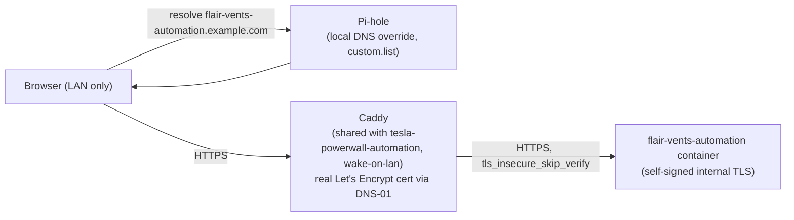

# Reverse Proxy / Local Hostname Setup — Handover Notes

- [Reverse Proxy / Local Hostname Setup — Handover Notes](#reverse-proxy--local-hostname-setup--handover-notes)
  - [Overview](#overview)
  - [Stack Overview](#stack-overview)
  - [How this differs from tesla-powerwall-automation's public setup](#how-this-differs-from-tesla-powerwall-automations-public-setup)
  - [Setup Steps (recipe for adding another local-only hostname)](#setup-steps-recipe-for-adding-another-local-only-hostname)
  - [Gotchas](#gotchas)
    - [1. CORS breaks the moment a new hostname is added](#1-cors-breaks-the-moment-a-new-hostname-is-added)
    - [2. The backend still terminates its own self-signed TLS](#2-the-backend-still-terminates-its-own-self-signed-tls)
  - [Expanding to Public Access Later](#expanding-to-public-access-later)
  - [Known Limitation](#known-limitation)

> **Note on the placeholders in this doc**: `flair-vents-automation.example.com`, `<app-internal-ip>`, `<caddy-internal-ip>`, `<caddy-container>`, and `<pihole-container>` are all stand-ins for this project's real values, mirroring `wake-on-lan`'s own doc convention — kept out of this repo deliberately; substitute your own when actually running these commands. (`.example.com` is an IANA-reserved domain that's never a real registrable name, so it can't be mistaken for a live address.)

## Overview

Per the implementation plan's [Flair OAuth Integration](README.md) decisions, this app's OAuth flow (`client_credentials` grant, confirmed sufficient during Phase 0) makes no browser-mediated redirect at all — and even in `authorization_code` mode, an OAuth `redirect_uri` is resolved by the _browser_, not by Flair's own servers, so nothing about this app's OAuth flow requires public reachability the way Tesla's callback does for `tesla-powerwall-automation`. Per the plan's own multi-tenancy/no-auth-initially decisions, this app also isn't meant to be publicly exposed.

So — same as `wake-on-lan` — this app is fronted by the **same shared Caddy instance** already running for `tesla-powerwall-automation`, but with a **local-only** hostname: it never gets a public DNS record and is never reachable from outside the home network. Direct LAN access via the raw IP and port still works too — this is additive, not a replacement.

## Stack Overview



No router port-forward is involved in this path at all — everything happens on the LAN.

## How this differs from tesla-powerwall-automation's public setup

- **No public A/CNAME record.** Let's Encrypt's DNS-01 challenge only requires proving domain ownership via a `_acme-challenge` TXT record through the Cloudflare API — it never needs the hostname to actually resolve anywhere reachable. Caddy gets a fully valid, browser-trusted certificate for this hostname even though it's unreachable from the public internet.
- **No router change.** Port 443 is already forwarded to Caddy for `tesla-powerwall-automation`'s hostnames; adding another site block to the same Caddy instance needs nothing new there, and since there's no public record for this hostname, that port-forward is irrelevant to this path anyway.
- **Resolution is scoped to the LAN** via a Pi-hole [Local DNS Record](#setup-steps-recipe-for-adding-another-local-only-hostname) instead of a public DNS provider CNAME. Anyone not using this network's Pi-hole for DNS gets `NXDOMAIN`, not a connection to anything.
- **Net result**: a real `https://` URL that only works on this network, with a properly trusted certificate (no per-device cert-trust step, unlike the app's own self-signed internal cert), and zero public exposure — matching this app's own "not publicly exposed" decision exactly, not just incidentally.

> **Worth knowing**: any certificate Let's Encrypt issues is recorded in public Certificate Transparency logs (e.g. crt.sh) the moment it's issued, regardless of whether a DNS record ever points anywhere. "Local-only" limits who can _reach_ the hostname, not who can _learn it exists_ — if that distinction matters to you, keep it in mind before picking a hostname.

## Setup Steps (recipe for adding another local-only hostname)

1. Add a site block to the existing Caddyfile (bind-mounted into `<caddy-container>`, shared with `tesla-powerwall-automation` and `wake-on-lan`):

   ```caddyfile
   flair-vents-automation.example.com {
       tls {
           dns cloudflare {env.CLOUDFLARE_API_TOKEN}
       }
       reverse_proxy https://<app-internal-ip>:3001 {
           transport http {
               tls_insecure_skip_verify
           }
       }
       log {
           output stdout
           format console
       }
   }
   ```

2. Reload Caddy — it issues the certificate immediately via DNS-01, with no wait on public reachability:

   ```sh
   docker exec <caddy-container> caddy reload --config /etc/caddy/Caddyfile --adapter caddyfile
   ```

3. Add a Pi-hole Local DNS Record so LAN devices actually resolve the name, then reload Pi-hole's DNS:

   ```sh
   docker exec <pihole-container> sh -c "echo '<caddy-internal-ip> flair-vents-automation.example.com' >> /etc/pihole/custom.list"
   docker exec <pihole-container> pihole restartdns reload
   ```

   The IP here is Caddy's own LAN IP, not the app container's — Pi-hole only needs to get the browser to Caddy; Caddy does the rest.

4. Add the new hostname to this app's `ALLOWED_ORIGINS` GitHub Secret (comma-separated alongside `https://localhost:5173` for dev — see `.github/workflows/deploy.yml`) and redeploy — see [Gotchas](#gotchas) below for why this step isn't optional.

## Gotchas

### 1. CORS breaks the moment a new hostname is added

Browsers send an `Origin` header on fetch/asset requests even when the request is same-origin from the page's own point of view — this app's `cors()` middleware (`src/server/main.ts`) rejects any origin not explicitly present in `ALLOWED_ORIGINS`. In practice (confirmed on `wake-on-lan`, the same pattern this app follows) this shows up as the browser refusing to apply a stylesheet (wrong MIME type, since the "stylesheet" it fetched was actually a JSON error response) and the main JS bundle failing to load — both before the new hostname is added to `ALLOWED_ORIGINS`. Direct-IP access is unaffected throughout, since that origin is already allow-listed.

**Fix**: every hostname the app is served under must be in `ALLOWED_ORIGINS`, full stop — there's no such thing as "it's basically the same origin, CORS won't care."

### 2. The backend still terminates its own self-signed TLS

Caddy's `reverse_proxy` hop to the app uses `https://` with `tls_insecure_skip_verify`, exactly like `tesla-powerwall-automation`'s and `wake-on-lan`'s existing blocks — this app's own HTTPS setup (`SSL_ENABLED=true`, `SSL_KEY_PATH`/`SSL_CERT_PATH`, the bind-mounted certs described in `deploy.yml`) doesn't change at all. That self-signed cert only matters for anyone bypassing Caddy and hitting the app's raw IP and port directly; anyone going through the Caddy-fronted hostname only ever sees Caddy's real, publicly-trusted certificate.

## Expanding to Public Access Later

Because the certificate is already real and obtained independent of reachability, going public later needs only:

- A public A/CNAME record for the same hostname, pointed at the home's dynamic-DNS hostname (same pattern `tesla-powerwall-automation` already uses).
- Nothing else — no Caddyfile change, no new certificate, no bookmark change. The same URL keeps working; it simply becomes reachable from outside the LAN too, the moment that DNS record exists.

Before that record is added, revisit whether this app should genuinely be reachable from the public internet at all — it has no authentication layer yet (per the plan's explicit deferred-auth decision) and controls real HVAC hardware; the LAN-only boundary is doing real access-control work today, not just tidiness.

## Known Limitation

This hostname only resolves for devices using this network's Pi-hole for DNS. Off this LAN (e.g. on mobile data), it won't resolve at all — that's expected, not a bug; use the direct IP and port instead, or wait until [public access](#expanding-to-public-access-later) is added.
